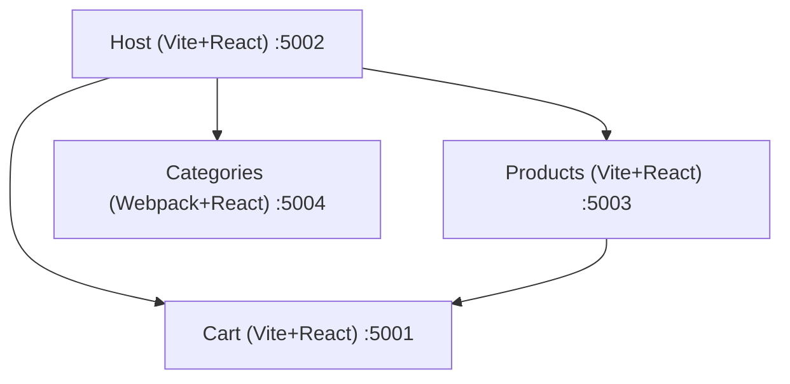

# Micro Frontend Module Federation

This project implements a small **e-commerce application** using **Micro Frontend Architecture** with **Module Federation**.

---

## Applications

- **Cart**  
  - A Vite + React application responsible for cart-related components.  
  - Runs on port **5001**.  
  - Acts as a **remote** for both the `Products` and `Host` apps.  

- **Products**  
  - A Vite + React application responsible for product listings and product details.  
  - Runs on port **5003**.  
  - Acts as a **remote** for the `Host` app.  

- **Categories**  
  - A Webpack + React application responsible for category management.  
  - Runs on port **5004**.  
  - Acts as a **remote** for the `Host` app.  

- **Host**  
  - A Vite + React application that integrates all the above applications to display a unified e-commerce platform.  
  - Runs on port **5002** (default, but can be changed if needed).  

> **Note:** If you change any app’s port, update the `vite.config.ts` file in both the `Products` and `Host` apps.

---

## Build and Run

Install dependencies:
```bash
npm install
```

⚠️ Important: Vite Federation generates remoteEntry.js only during the build step (not in dev mode).
You must build and serve the apps instead of running them directly in dev.

```bash
# Build the apps (with watch mode for development)
npm run build:watch

# Serve the apps
npm run serve
```


